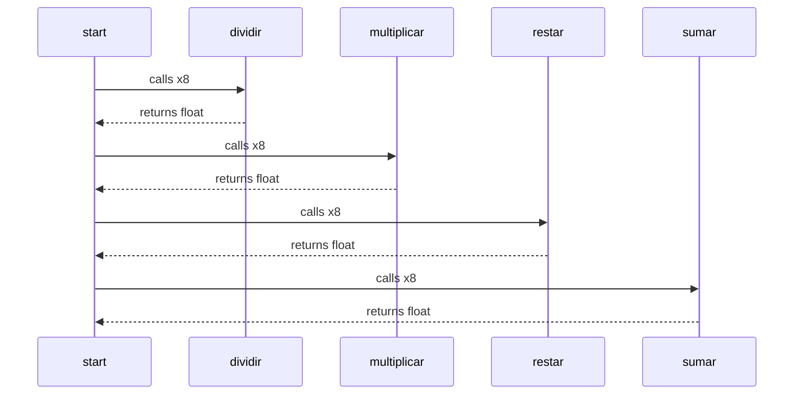

This is a mermaid diagram, you may need to install a [Browser Plugin](https://github.com/BackMarket/github-mermaid-extension) or [VsCode extension](https://marketplace.visualstudio.com/items?itemName=bierner.markdown-mermaid) or similar to view it.

You can also [view it full screen as an SVG](https://mermaid.ink/svg/c2VxdWVuY2VEaWFncmFtCiAgc3RhcnQtPj5kaXZpZGlyOiBjYWxscyB4OAogIGRpdmlkaXItLT4+c3RhcnQ6IHJldHVybnMgZmxvYXQKICBzdGFydC0+Pm11bHRpcGxpY2FyOiBjYWxscyB4OAogIG11bHRpcGxpY2FyLS0+PnN0YXJ0OiByZXR1cm5zIGZsb2F0CiAgc3RhcnQtPj5yZXN0YXI6IGNhbGxzIHg4CiAgcmVzdGFyLS0+PnN0YXJ0OiByZXR1cm5zIGZsb2F0CiAgc3RhcnQtPj5zdW1hcjogY2FsbHMgeDgKICBzdW1hci0tPj5zdGFydDogcmV0dXJucyBmbG9hdAo=)        

